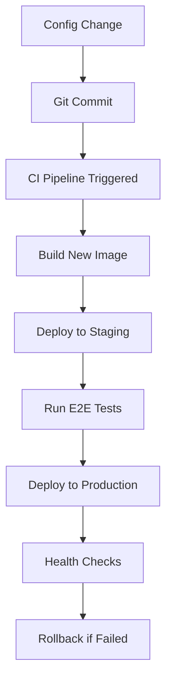

# 🏭 Production Configuration Management Strategy

## Industry Standard Approach for EIP-resso

This document outlines **real-world production practices** for configuration management in enterprise systems, replacing naive approaches like file polling with **proven industry standards**.

---

## ❌ **What We DON'T Do in Production**

### File Polling (Anti-Pattern)
```java
// THIS IS WRONG FOR PRODUCTION
from("file://config-repo?noop=true&delay=5000")
    .log("Config file changed - reloading...")
```

**Why this is wrong:**
- **Brittle**: Relies on filesystem access in containers
- **Unreliable**: File system events are inconsistent across platforms
- **Security risk**: Containers shouldn't have write access to config directories
- **Not cloud-native**: Doesn't work with Kubernetes ConfigMaps/Secrets
- **Performance**: Unnecessary polling overhead

### Runtime Configuration Changes (Anti-Pattern)
```java
// THIS IS ALSO WRONG
from("timer://webhook-handler")
    .to("http://git-api/changes")
    .process("updateConfigurationAtRuntime")
```

**Why this is wrong:**
- **Consistency**: Runtime changes create configuration drift
- **Reliability**: No guarantee all instances get updated simultaneously
- **Rollback**: Difficult to rollback configuration changes
- **Audit**: Hard to track what configuration was active when

---

## ✅ **What We DO in Production**

### 1. **Immutable Configuration Pattern**

**Core Principle**: Configuration is **baked into containers** at build time and **never changes at runtime**.

```yaml
# Kubernetes ConfigMap - The Source of Truth
apiVersion: v1
kind: ConfigMap
metadata:
  name: config-server-config
data:
  ENVIRONMENT: "production"
  CONFIG_GIT_URI: "https://github.com/your-org/eip-resso-config.git"
  LOG_LEVEL: "INFO"
```

**Configuration changes = New deployment**

### 2. **Environment Variable Injection**

All configuration comes from **environment variables**, following [12-Factor App](https://12factor.net/config) principles:

```java
@Value("${CONFIG_GIT_URI}")
private String gitUri;

@Value("${ENVIRONMENT:production}")
private String environment;
```

### 3. **Separate Configuration Repository**

```
eip-resso-microservices/     # Application code
├── config-server/
├── user-service/
└── order-service/

eip-resso-config/           # Configuration repository
├── application.yml         # Global config
├── user-service.yml        # Service-specific config
└── order-service-prod.yml  # Environment-specific config
```

### 4. **CI/CD Configuration Pipeline**



**Key Points:**
- Configuration changes trigger **new deployments**
- **Blue-green deployments** ensure zero downtime
- **Automatic rollback** if health checks fail
- **Comprehensive testing** before production

---

## 🔧 **Implementation Details**

### Standard Production Camel Route

Instead of file polling, we focus on **health monitoring** and **metrics collection**:

```java
@Component
@ConditionalOnProperty(name = "eip-resso.config.mode", havingValue = "standard-production")
public class StandardProductionRoute extends RouteBuilder {
    
    @Override
    public void configure() throws Exception {
        // NO file polling - just health checks and metrics
        from("timer://config-health?period=30000")
            .routeId("config-health-monitor")
            .to("http://localhost:8888/actuator/health/configServer")
            .to("micrometer:counter:config.health.checks");
    }
}
```

### Kubernetes Deployment Strategy

```yaml
apiVersion: apps/v1
kind: Deployment
spec:
  replicas: 2
  strategy:
    type: RollingUpdate    # Zero-downtime deployments
  template:
    spec:
      containers:
      - name: config-server
        envFrom:
        - configMapRef:
            name: config-server-config  # Non-sensitive config
        env:
        - name: CONFIG_SERVER_PASSWORD
          valueFrom:
            secretKeyRef:
              name: config-server-secrets  # Sensitive config
              key: CONFIG_SERVER_PASSWORD
```

### Configuration Refresh (When Needed)

For the rare cases where runtime refresh is needed:

```bash
# Manual refresh via actuator endpoint
kubectl exec -it config-server-pod -- \
  curl -X POST http://localhost:8889/actuator/refresh

# Or using Spring Cloud Bus (if configured)
kubectl exec -it config-server-pod -- \
  curl -X POST http://localhost:8889/actuator/bus-refresh
```

---

## 🚀 **Production Deployment Flow**

### 1. **Development**
```bash
# Developer makes config change
git commit -m "Update database connection pool size"
git push origin feature/db-config-update
```

### 2. **CI Pipeline**
```yaml
# GitHub Actions automatically:
- name: Build and test
- name: Security scan
- name: Build Docker image
- name: Deploy to staging
- name: Run E2E tests
- name: Deploy to production (if tests pass)
```

### 3. **Kubernetes Deployment**
```bash
# CI/CD updates ConfigMap
kubectl create configmap config-server-config \
  --from-literal=DB_POOL_SIZE=20 \
  --dry-run=client -o yaml | kubectl apply -f -

# Triggers rolling update
kubectl rollout restart deployment/config-server
```

### 4. **Health Verification**
```bash
# Automatic health checks
kubectl wait --for=condition=ready pod -l app=config-server
curl -f http://config-server:8889/actuator/health
```

---

## 📊 **Monitoring and Observability**

### Health Checks
```java
// Built-in Spring Boot actuator endpoints
/actuator/health           # Overall health
/actuator/health/configServer  # Git repo connectivity
/actuator/info            # Build and runtime info
/actuator/metrics         # Application metrics
```

### Prometheus Metrics
```java
// Custom metrics via Micrometer
from("timer://config-metrics?period=60000")
    .to("micrometer:counter:config.requests.total")
    .to("micrometer:timer:config.response.time");
```

### Structured Logging
```yaml
logging:
  pattern:
    # JSON format for log aggregation (ELK, Splunk, etc.)
    console: '{"timestamp":"%d","level":"%-5level","logger":"%logger{36}","message":"%msg"}%n'
```

---

## 🔐 **Security Best Practices**

### Secret Management
```yaml
# Kubernetes Secrets (not ConfigMaps) for sensitive data
apiVersion: v1
kind: Secret
metadata:
  name: config-server-secrets
type: Opaque
data:
  CONFIG_SERVER_PASSWORD: <base64-encoded>
  GIT_TOKEN: <base64-encoded>
```

### RBAC and Service Accounts
```yaml
apiVersion: v1
kind: ServiceAccount
metadata:
  name: config-server
---
apiVersion: rbac.authorization.k8s.io/v1
kind: Role
rules:
- apiGroups: [""]
  resources: ["configmaps", "secrets"]
  verbs: ["get", "list"]
```

### Network Policies
```yaml
apiVersion: networking.k8s.io/v1
kind: NetworkPolicy
metadata:
  name: config-server-policy
spec:
  podSelector:
    matchLabels:
      app: config-server
  policyTypes:
  - Ingress
  ingress:
  - from:
    - podSelector:
        matchLabels:
          component: microservice
```

---

## 🎯 **Key Takeaways**

### ✅ **Do This:**
1. **Externalize all configuration** via environment variables
2. **Use Kubernetes ConfigMaps** for non-sensitive config
3. **Use Kubernetes Secrets** for sensitive config
4. **Configuration changes = new deployments**
5. **Implement comprehensive health checks**
6. **Use blue-green or rolling deployments**
7. **Monitor configuration server health**
8. **Implement automatic rollback on failure**

### ❌ **Don't Do This:**
1. File polling or filesystem watching
2. Runtime configuration changes
3. Hardcoded configuration values
4. Mixing configuration with application code
5. Complex webhook systems for config changes
6. Manual configuration deployments
7. Ignoring security and secret management
8. Skipping health checks and monitoring

---

## 📝 **Real-World Examples**

### Netflix
- Uses **Archaius** for configuration management
- **Immutable deployments** with configuration baked in
- **A/B testing** through configuration flags
- **Canary deployments** for configuration changes

### Spotify
- **ConfigMaps and Secrets** in Kubernetes
- **GitOps** approach with **ArgoCD**
- **Feature flags** for runtime behavior changes
- **Comprehensive monitoring** of configuration health

### Uber
- **Service configuration** via environment variables
- **Centralized configuration** with **Consul** or **etcd**
- **Gradual rollouts** for configuration changes
- **Automatic rollback** on error rate increases

---

This approach follows **industry best practices** and is **battle-tested** at scale. It's reliable, secure, observable, and maintainable - everything you need for **production-grade** configuration management. 